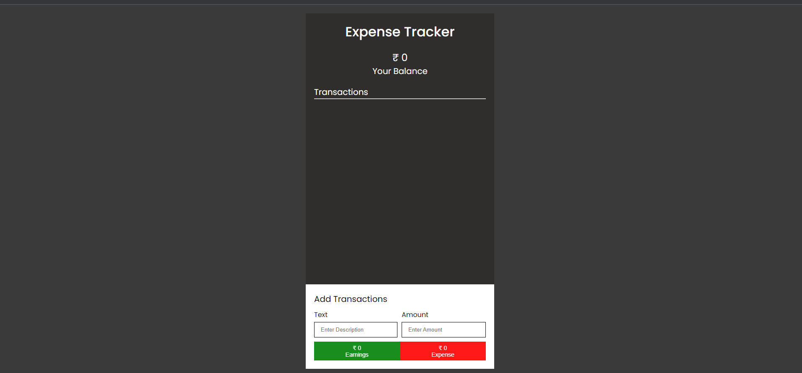
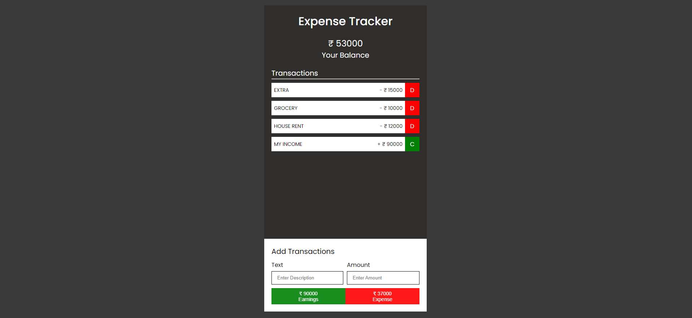
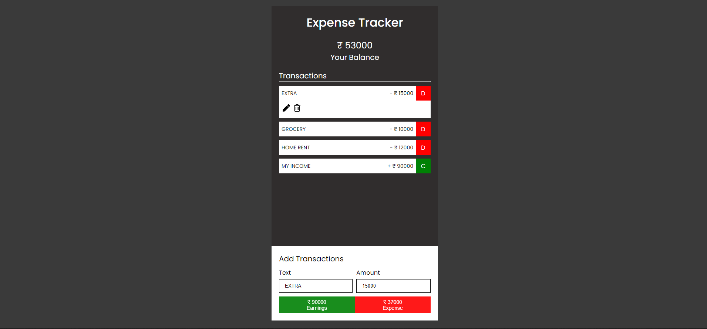

# Expense Tracker 

This is an expense tracker web application built using HTML, CSS, and JavaScript. This application allows users to track their expenses and income by adding transactions to the list. The user can also see their total balance and the expense in a chart.

## Demo

A demo of the application can be found [here](https://example.com).

## Features

- Add transactions (expense or income)
- Modify transcations
- Delete transactions
- View total balance

## Technologies Used

- HTML
- CSS
- JavaScript

## Getting Started

1. Clone the repository to your local machine using the command `git clone https://github.com/d-2610/Expense_Tracker.git`.
2. Open `index.html` in your web browser.
3. Start tracking your expenses and income.

## Screenshots

## License

This project is licensed under the MIT License. See the [LICENSE](LICENSE) file for details.